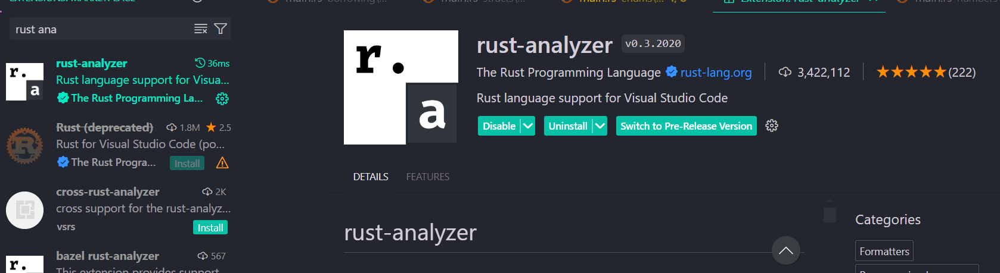

# Rust Bootcamp

## Rust Learning Syllabus

### Easy

1. **Installing Rust**

   - Download and install Rust from the [official site](https://www.rust-lang.org/).

2. **IDE Setup**

   - We will be using Visual Studio Code (VS Code) as our IDE.

- You might need to install VS Code development tools for C or C++. If you have MinGW already on your local machine, you can download a toolchain with the following commands (if your desktop is Windows 64-bit). For more details, visit their website or search the web:

```bash
rustup toolchain install stable-x86_64-pc-windows-gnu
```

```bash
rustup default stable-x86_64-pc-windows-gnu
```

- Verify the installation:

```bash
rustc --version
```

```bash
cargo --version
```

- Install the Rust extension for VS Code for better development experience.



3. **Initializing a Project Locally**

   ```bash
    mkdir new_folder
    cd new_folder
    cargo init
   ```

   or

   ```bash
   cargo new new_folder
   cd new_folder
   ```

   - How to set up a new Rust project on your local machine using Cargo.

4. **Variables**

   - Understanding numbers, strings, and booleans in Rust.

5. **Conditionals and Loops**

   - Writing conditional statements and loops in Rust.

6. **Functions**

   - How to define and use functions in Rust.

7. **Structs**

   - Understanding and using structs to create custom data types.

8. **Enums**

   - Using enums to define a type by enumerating its possible variants.

9. **Optional/Result**

   - Handling optional values and error management using `Option` and `Result`.

10. **Pattern Matching**

    - Using pattern matching with `match` and `if let`.

11. **Package Management**
    - Managing packages and dependencies with Cargo.

### Hard

1. **Memory Management**

   - Understanding how Rust manages memory.

2. **Mutability**

   - Understanding mutable and immutable variables.

3. **Stack vs Heap**

   - Learning the differences between stack and heap memory.

4. **Ownership**

   - Understanding Rust’s ownership model.

5. **Borrowing**

   - Borrowing references and understanding their rules.

6. **References**
   - Using references in Rust and their lifetimes.

### Upcoming

1. **Traits**

   - Understanding and implementing traits.

2. **Generics**

   - Using generics for flexible and reusable code.

3. **Lifetimes**

   - Managing lifetimes and understanding their importance.

4. **Multithreading**

   - Writing concurrent programs using threads.

5. **Macros**

   - Understanding and using macros for metaprogramming.

6. **Futures/Async Await**
   - Writing asynchronous code with futures and async/await.

